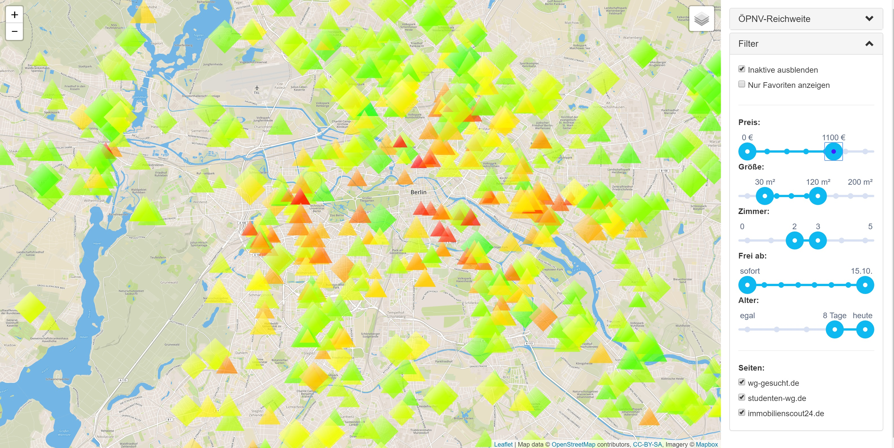

# Wohnung Scraper

This tool scrapes several online real estate listing websites and visualizes offers in a map. 

## Screenshot

## Features:

* new offers are scraped regularly
* properties like the price, size and other stuff (balcony available) are extracted, parsed and stored
* addresses are converted into geo coordinates
* existing offers are checked regularly, so that offers which are offline, will be hidden
* all offers are shown on the map:
  * the color shows the price per m² from low (green) to red (high)
  * the number of edges of the polygon visualizes the number of rooms + 1 (so 2 rooms = triangle, 3 rooms = square, ...)
  * the size of the polygon shows the total size (the more m² the flat has, the bigger it is)
* the map allows filtering by properties (default properties are configurable)
* the map includes several helpful map layers
  * the usual boring street and satellite layers
  * public transport layer
  * noise map (thanks to the great work of [Berliner Morgenpost](https://interaktiv.morgenpost.de/laermkarte-berlin/))
  * custom OpenStreetMaps layer generated by Mapbox shows churches (might be noisy!)
  * more layers possible: schools (noisy in the morning), markets (shouldn't be too far away), other public transport (bike sharing stations, ...)
* it's possible to visualize how far you can get using public transport in x minutes from a selected marker on the map (there's a slider as well - big thanks to the great work of [Mapnificent](https://www.mapnificent.net/berlin/))
* it offers direct links to specific locations using public transport (BVG in Berlin only for now...) when selecting a marker (e.g. how long does it take to get from home to work)
* a telegram bot sends new offers as soon as they arrive, if they match given filters
* it's possible to set favorites for easier filtering and tracking

## Set up

1. Create your own `config.js` by using the `config.template.js`
2. Create a SQLite db `wohnungen.db` using the `wohnungen.db.sql` file
3. `npm install` and `npm start` 
4. Get lucky on [localhost:3000](http://localhost:3000)

## Roadmap

This was privately developed to get a new flat in Berlin (which worked very quickly and well btw). The following features might be very helpful:

- [ ] fix scrapers (some broke due to some missing dynamics in the screen scraping process)
- [ ] make the set up process easier (e.g. create db automatically)
- [ ] localize app (it's currently German only...)
- [ ] rewrite bad Angular code in React perhaps? Also, there's still Bower on board...
- [ ] add support for more cities (map layers, let users create scripts for cities which can be reused)
- [ ] there's definitely more 🚀

## Remarks

Please note that the usage might be illegal as you scrape data which is not yours! I'm not affiliated with any of the sites scraped or tools used here and everything you do with it is on your own risk.